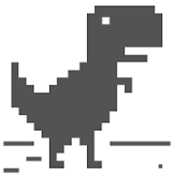

# brillianintdoh (개발자)  
> 학생 개발자 • **백엔드**

 

# 🦖 Chrome dino_rumble (Godot C++)

  
  
  
Godot 엔진과 C++로 제작한 크롬 공룡 멀티 버전 게임

## 📝 프로젝트 소개
크롬 브라우저의 인터넷 연결 끊김 미니게임을 Godot 엔진으로 멀티버전으로 구현한 프로젝트입니다. C++를 사용하여 게임 로직을 구현하고 서버와 websocket으로 멀티를 구현한 게임입니다

## 🚀 시작하기
