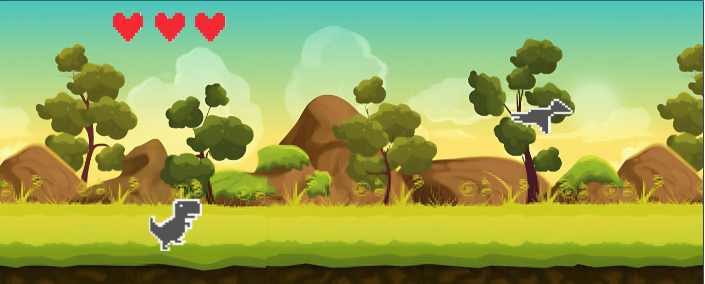
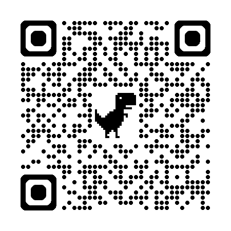

# 🦖 Chrome dino_rumble (Godot C++)

  
  
  
Godot 엔진과 C++로 제작한 크롬 공룡 멀티 버전 게임

## 📝 프로젝트 소개
크롬 브라우저의 인터넷 연결 끊김 미니게임을 Godot 엔진으로 멀티버전으로 구현한 프로젝트입니다. C++를 사용하여 게임 로직을 구현하고 서버와 websocket으로 멀티를 구현한 게임입니다.

## 🎮 게임 구성요소

### 주요 캐릭터
- **공룡 (플레이어 1)**: 장애물을 피해 달리는 메인 캐릭터
- **프테라노돈 (플레이어 2)**: 공룡을 향해 돌을 던지는 적 캐릭터

### 게임 오브젝트
- **장애물**: 공룡이 피해야 하는 여러 장애물
- **하트**: 공룡의 생명력을 나타내는 시스템
- **배경**: 끊임없이 움직이는 동적 배경

## 🕹 게임 플레이 방법

### 조작 방법
- **공룡 (P1)**
  - ↑: 위
  - ↓: 아래
  
- **프테라노돈 (P2)**
  - ↑: 위
  - ↓: 아래
  - Space: 돌 던지기

### 게임 목표
- **공룡**: 최대한 오래 생존하기
- **프테라노돈**: 공룡 처치하기

## 🌐 멀티플레이
- WebSocket을 통한 실시간 대전
- 친구와 함께 즐기는 1:1 대결

## 🎮 게임 접속
<a align="center" href="https://game.ourgram.co.kr/">
  
  
QR코드를 스캔하여 게임 접속

</a>